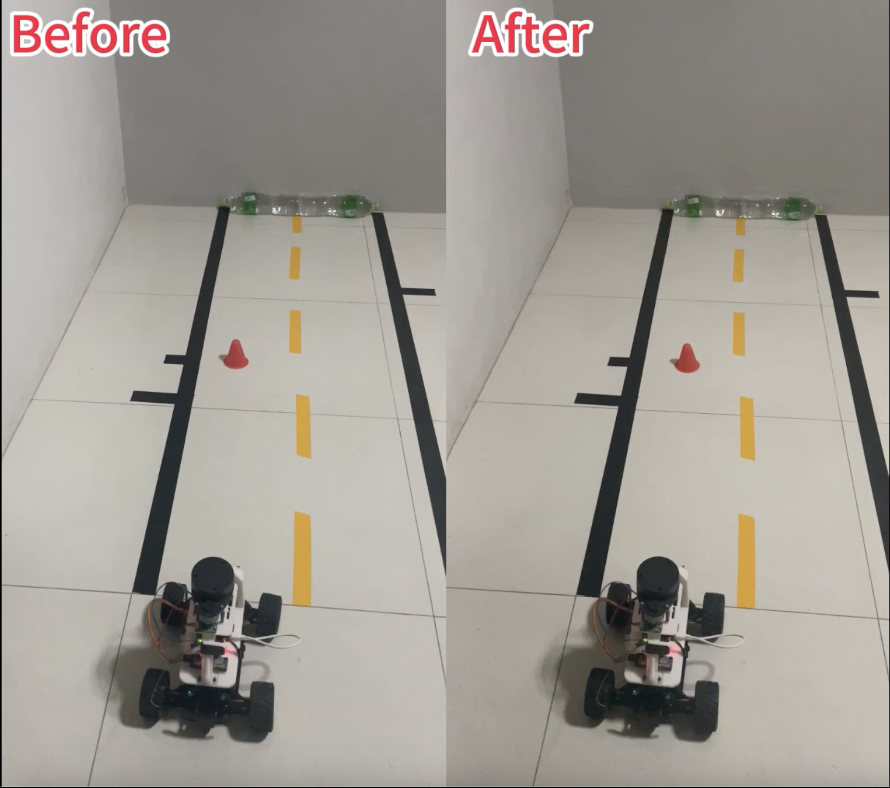

Sure, here's a suggested Readme for the GitHub repository based on the provided paper:

# Bezier Curve Optimization for Autonomous Vehicle Control

This repository contains the implementation of a novel control signal optimization method for autonomous vehicles based on Bezier curves. The proposed approach enhances trajectory tracking accuracy, control signal smoothness, and vehicle posture stability, leading to improved overall performance in autonomous driving systems.
## 👇👇👇Click on the image to play the video on YouTube.⬇️⬇️⬇️⬇️⬇️⬇️
[](https://youtu.be/3Gh3RCR1B3Y?si=ovzhLek9PLTm9RIY)
## Overview
[(image4.png)]
The core idea is to apply Bezier curves to the generation of control signals, such as throttle and steering, for autonomous vehicles. By optimizing the shape of the Bezier curves, smooth and continuous control signals can be obtained, resulting in precise trajectory tracking and stable vehicle behavior.

Key features of this approach include:

1. **Throttle Optimization**: A second-order Bezier curve is employed to optimize the throttle signal, ensuring smooth acceleration and deceleration.
2. **Steering Optimization**: A third-order Bezier curve is utilized to optimize the steering angle signal, enabling smooth and continuous steering adjustments.
3. **Bezier Smoothing Loss (BSL)**: A novel loss function is introduced to simultaneously optimize control signal smoothness and trajectory tracking accuracy during neural network controller training.

## Experimental Results

Extensive experiments were conducted on the Donkey Car platform, a 1:16 scale autonomous vehicle, in three typical scenarios: left lane driving with obstacle avoidance, straight-line driving, and straight driving with continuous obstacle avoidance. The proposed method demonstrated significant improvements compared to baseline methods:

- Trajectory tracking accuracy (RMSE) improved by up to 19.6%.
[(image1.png)]
- Throttle change rate standard deviation decreased by 28.6%.
- Steering angular velocity standard deviation reduced by 24.5%.
[(image3.png)]
- Vehicle yaw rate and pitch rate RMS values decreased by 7.9%.
 [(image2.png)]

## Installation

To use this repository, you'll need to have the following software installed:

- Python 3.8
- TensorFlow 2 
- OpenCV 4.1 or later
- Donkey Car framework (version 4.5 or later)

After cloning the repository, you can install the required Python packages by running:

```
pip install -r requirements.txt
```

## Usage

1. Assemble and configure the Donkey Car hardware according to the official documentation.
2. Set up the predefined trajectories and scenarios for testing.
3. Train the neural network controller with the provided Bezier Smoothing Loss (BSL) function.
4. Deploy the trained model on the Donkey Car and run the autonomous driving experiments.
5. Collect and analyze the data to evaluate the performance improvements.

Detailed instructions and code examples are provided in the repository's documentation.

## Contributing

Contributions are welcome! If you have any ideas, bug reports, or feature requests, please open an issue or submit a pull request.

